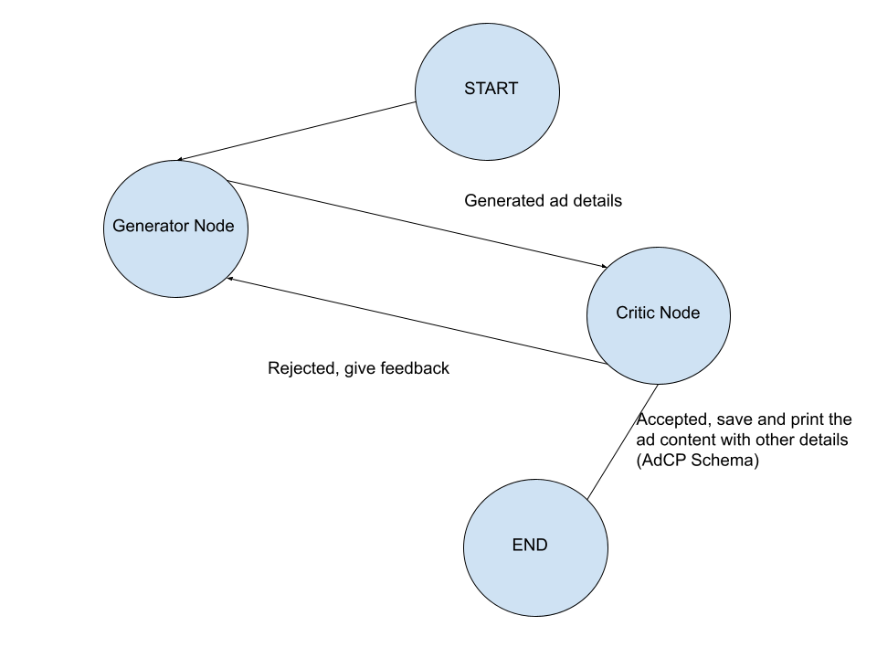
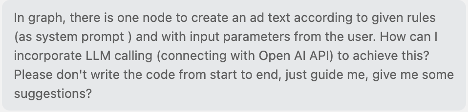
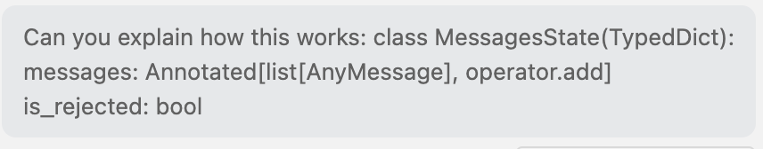

# Agentic Ad Content Generator with LangGraph
This repository demonstrates an agentic ad-content generation workflow with LangGraph and LangChain. Generator and critic LLM instances operate as separate nodes in a state-driven graph. The system iteratively generates and evaluates short ad captions based on structured product metadata, using Pydantic-enforced outputs and patch-based state updates to ensure predictability, token efficiency, and controlled iteration. The final output is emitted as a structured JSON artifact (and saved as json file), making the pipeline easy to test, reason about, and extend.
## Architecture
The system is implemented using LangGraph with two LLM nodes:

* **Generator Node:** Produces ad content based on product metadata and audience.

* **Critic Node:** Evaluates the generated content against predefined rules and provides feedback.

There are no tool nodes or external tool invocations in this workflow. All reasoning and iteration happen within the agent graph itself.

LangGraph was chosen because it provides explicit, controllable state transitions, making iterative generation loops (generate → critique → regenerate) easier to reason about and safer to manage compared to ad-hoc prompt chaining.

## How to run?
The project supports both local execution (virtual environment) and Docker-based execution. All common commands are wrapped in a Makefile.
### Environment setup

The OpenAI API key is loaded from a .env file.

.env: 
OPENAI_API_KEY=your_api_key_here

### Run Locally

- make venv         # Create virtual environment
- make install      # Install requirements
- make test-local   # Run unit and integration tests
- make run-local    # Run the ad agents
- make clean-venv:  # Remove the environment

### Run with Docker

- make build          # build Docker image
- make run            # run the agent in a container
- make test           # run all tests in Docker
- make down           # stop container and remove image

## How did I use AI asisstants?

I implemented the core codebase and overall architecture manually. I used AI assistants selectively, mainly for:

- troubleshooting some errors,

- having guidance to implement some steps (e.g. structured output enforcement for agent frameworks )

- exploring alternative implementation approaches.

My primary references to write the code were the LangChain & LangGraph documentation. I deliberately made the choice, as AI assistants can sometimes hallucinate or suggest outdated or non-idiomatic patterns.

For in-editor assistance, I used Microsoft Copilot within Visual Studio Code to speed up small iterations and syntax-related tasks.

Below are example prompts I used during development:
Here are some sample prompts I used: 






## Structured Output Enforcement

All LLM outputs in this project are strictly structured using Pydantic models. Each LangGraph node enforces a schema via with_structured_output(...), ensuring predictable, validated outputs.
```python 
self.generator_llm = ChatOpenAI(
    model="gpt-4o-mini"
).with_structured_output(GenerationAsset)

self.critic_llm = ChatOpenAI(
    model="gpt-4o-mini"
).with_structured_output(CriticResult)
```

## Patch-based State Updates (Token-Efficient Design)

Rather than passing the entire state or full Pydantic models between nodes, each LangGraph node returns a patch (a partial state update). LangGraph then merges these patches into the global state using field-level reducers.
```python
return {
    "generation_asset": generation_asset,
    "messages": [AIMessage(content=generation_asset.content)],
}

```
This approach is intentional. Passing full Pydantic models or accumulated message histories between nodes can quickly inflate the prompt size, leading to unnecessary token consumption and, in extreme cases, context-length errors. 

## Sample Inputs

The file 'sample_inputs.txt' contains example inputs in the format:

*Product name, product description, target audience*

- Each line represents a single, independent run of the agent. Only one line is used per execution.

- All samples are neutral and brand-safe and cover a range of products and audiences.

Example:

Cadbury Dairy Milk, milk chocolate bar, Adults

## Trade-offs and Challenges

- In each agent framework run, only one product information is given and one ad text is generated. Batch processing is not included. The reason is that I prefereded to spend my limited available time on structured output enforcement.

- I could have implemented the workflow wihtout using LangGraph (via only functions with LLM connections and loops). Introducing LangGraph added more overhead, but it made schema enforcement and execution traceability significantly easier. In particular, I found the GraphState abstraction in LangGraph very intuitive for managing state across iterations. I chose LangGraph over other frameworks (e.g. AutoGen) because I had prior experience. Considering the limited available time, I preferred not to introduce the learning curve of a new tool. With more time, I would explore how other frameworks approach schema enforcement and state management.

- There is no agent evaluation implementation in this project. In a production-grade system, systematic agent evaluation is essential. My primary focus here was on schema enforcement and generating ad content that complies with predefined rules. For that reason, I intentionally didn't apply agent evaluation.

- The most challenging part was ensuring each LLM instance produces a valid Pydantic model rather than a string and what information to pass between nodes to prevent excessive token consumption. 
 

 ## Updates
- Deterministically define content length and emoji count.
- Introduce MAX_ITER and track iteration as a state variable to prevent infinite loops.
- Eliminate inconsistencies between Critic and Generator system prompts.  
- Tidy up terminal print statements.
- Rename OPEN_API_KEY to OPENAI_API_KEY".   